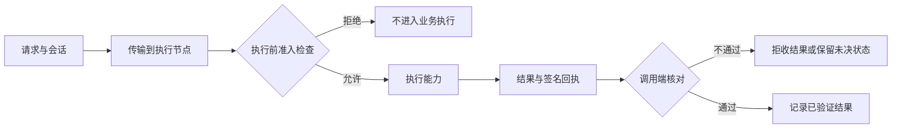

# TINP

**执行前拦截不合权限的请求，执行后核对结果与回执。**

多个 AI 智能体和服务接起来以后，仅仅“能调用”还不够。调用者可能没有权限，权限可能已经过期；服务也可能执行完了，但结果没能传回来。

TINP 的在线执行链先在执行节点检查身份、权限、会话和路由约束。不通过，就不运行该业务能力；通过后才执行，再由调用端核对结果与请求的对应关系。**不是先执行，再靠事后审计补做授权。**

## 为什么已经拦截了，还要复核？

两者回答的是不同问题：

| 环节 | 回答什么 | 检查失败时 |
|---|---|---|
| 执行前准入 | 这个主体现在能否执行这次请求？ | 拒绝进入业务执行 |
| 传输与执行 | 由哪个节点处理，路径失败后如何处理？ | 按约束尝试替代路径，或明确保留未完成状态 |
| 执行后核对 | 返回结果是否对应这次请求，回执是否有效？ | 不接受为已验证结果；不等于撤销已发生的动作 |

源头预检可以提前报错，但**执行端不能只相信调用者说“我已经检查过”**。主节点和备用节点都要在执行前检查。这里的“源头禁止”，指受控业务入口上的强制准入，不是给操作系统中的任意程序套上全局拦截。

TINP 也提供单独的离线回执校验工具。它只核对已有结果，不拦截此前发生的执行，更不会自动授予新权限。详细分工和测试见 [执行前约束与执行后核对](docs/ENFORCEMENT_AND_EVIDENCE.md)。

> 当前版本：`0.1.0-alpha.29`  
> 当前状态：`VERIFIED_LOCAL_CANDIDATE / NOT_DEPLOYED`

当前版本已经通过本机集成验证，但仍是研究/试点候选，不是生产公网，也不声称已经具备生产级密钥托管、第三方安全认证或军用安全认证。

> **License TL;DR：** 当前对外许可与发行资格仍是 `NOT_ADJUDICATED`。公开仓库不等于整仓已经获得统一商业再分发许可；对外打包、再分发或商业发行前，需要先完成 `vendor/` 等历史来源组件的许可裁决。详见 [`docs/LICENSE_AUDIT.md`](docs/LICENSE_AUDIT.md)。

## 先看业务故障 Demo

比“字符计数”更容易理解 TINP 的方式，是直接看一个企业内部 Agent 请求在故障时怎么处理。

```powershell
python -m pip install -r adapters/requirements.txt
node scripts/business-demo.mjs
```

如果想把**这一次真实运行**保存成 JSON：

```powershell
node scripts/business-demo.mjs --out .runs/business-demo-output.json
```

输出会记录主体、会话、实际路由、实际 Provider、服务等级、权限租约根、回执根和当前证据根。

当前回归套件已经固定验证了这些行为：

| 场景 | 路由 | Provider | 服务等级 |
|---|---|---|---|
| 正常执行 | `A -> B -> C` | `C:counter` | `Full` |
| 主 Provider C 不可用 | `A -> B` | `B:counter` | `Essential` |
| A-B 链路故障 | `A -> C` | `C:counter` | `Reduced` |
| 所有 Provider 不可用 | 不执行 | 无 | `Survival`，返回 `deferred / NO_AUTHORIZED_PROVIDER` |

这些断言来自当前 `tests/profiles.test.mjs`。业务文本只是演示载荷，不连接真实 CRM；底层 Provider 仍使用只读、确定性的测试能力。

完整说明见 [`BUSINESS_DEMO.md`](BUSINESS_DEMO.md)。

## 什么时候你会需要它？

如果你只有一个 Agent 调几个普通 API，TINP 很可能不是必需的。

当系统开始出现下面这些问题时，TINP 才有价值：

```text
能不能调用
    ↓
谁能调用
    ↓
能调用多久
    ↓
由哪个节点执行
    ↓
失败能不能重试
    ↓
换节点后权限还算不算
    ↓
出事后怎么证明当时发生了什么
```

典型场景包括：私有 Agent 网络、企业内部自动化、边缘/本地节点协作，以及需要恢复和审计的受控执行。

## 它和你已经认识的工具有什么区别？

TINP 不是用来取代这些工具的。

| 技术 | 主要解决什么 | TINP 补在哪里 |
|---|---|---|
| **MCP** | Agent 怎么发现和调用工具 | 调用前后的身份、权限、失败和证据 |
| **A2A** | Agent 与 Agent 怎么通信协作 | 执行治理、节点、权限和恢复 |
| **gRPC / REST** | 服务怎么发请求和收响应 | 不替代 RPC；关注请求背后的主体和执行状态 |
| **OAuth / OIDC** | 认证与授权委托 | 可以一起使用；TINP 不替代 OAuth/OIDC |
| **Temporal** | 持久工作流和重试编排 | 有恢复问题交集，但 TINP 不是工作流引擎 |
| **Kafka / RabbitMQ** | 消息传输、队列和缓冲 | TINP 不重新发明消息队列 |
| **OPP** | 能力是什么、两个系统能不能接 | TINP 接管身份、权限、路由、恢复和证据 |

更完整的说明见 [`docs/COMPARISON.md`](docs/COMPARISON.md)。

## OPP + TINP 目前已经打通到哪里？

两者的分工可以先这样理解：

```text
企业现有系统 / API / Agent / MCP
              ↓
             OPP
        能不能接？怎么转？
              ↓
             TINP
     谁能调用？失败怎么办？
              ↓
       执行 + 回执 + 恢复
```

alpha.29 已经有一条真实、固定、可复核的组合证据：**TINP 对 OPP native interop receipt 做精确结构和 root 校验，再生成 acceptance binding。**

```text
OPP interop receipt root:
77b4cdfaa0f95a9cc75a4c7d08f9d8cc3b94d40f2a9b46b87c51b2b1496f7ff2

TINP acceptance root:
0d51f4f1183294ce50137fa75f9decb4fdf5f387f9ec5846b3bce3ec42bf9bb5

status: PASS
authorityGranted: false
sideEffects: false
```

证据文件：

- [`evidence/0.1.0-alpha.29/opp-native-interop-acceptance.json`](evidence/0.1.0-alpha.29/opp-native-interop-acceptance.json)
- [`evidence/0.1.0-alpha.29/EVIDENCE_LEDGER.json`](evidence/0.1.0-alpha.29/EVIDENCE_LEDGER.json)

这证明的是**当前候选能够验收绑定一条 OPP-owned interop 结果**，不是“任意 OPP bridge 已经自动进入生产 TINP 网络”。

## 我怎么接自己的 Agent / Provider？

当前已经有可用的 alpha 接口，但还没有稳定的第三方 Provider SDK。

现在的集成表面包括：

- Caller：`InternetSuite.start()` + `suite.use(...)`；
- OPP native interop acceptance：`src/opp-native-interop.mjs`；
- 受策略约束的只读 HTTPS / JSON adapter；
- 仓库内部 Provider manifest / node process 路径。

如果今天要接一个新的 Provider，仍属于**源码级 PoC 集成**：需要定义 capability、Provider manifest、执行入口、签名 receipt，并补权限/故障/重放/恢复负例测试。

完整步骤和当前 public surface 边界见 [`docs/INTEGRATION.md`](docs/INTEGRATION.md)。

## 技术最小 Demo（3 分钟）

如果想看最小执行链：

```powershell
python -m pip install -r adapters/requirements.txt
npm run demo -- "我要使用字符计数能力完成：你好，TINP"
```

对这个固定输入，当前逻辑的稳定业务结果是：

```json
{
  "结果": {"count": 7},
  "状态": "Full",
  "路径": ["A", "B", "C"],
  "验证范围": "三个独立本机进程，真实回环传输"
}
```

PID、端口、会话和各类 hash/root 是运行时生成值，不写成固定常量。若要看你这一次运行的完整值，直接运行命令即可。

当前版本完整验证记录：

```text
209 / 209 tests passed
0 failed
status: VERIFIED_LOCAL_CANDIDATE
```

证据见 [`evidence/0.1.0-alpha.29/INTEGRATION_COURT.md`](evidence/0.1.0-alpha.29/INTEGRATION_COURT.md)。

## 它实际做了什么？



当前准入检查在 `src/node-process.mjs` 中调用 RCL 路由规则和事务规则，之后才进入业务计算。调用端的 `verifyReceipt` 则核对签名、请求、会话、租约、结果等绑定关系。

回执不是“事情绝对正确”的证明：签名用于核对来源与完整性；字符计数示例还会独立核算结果。任意业务的正确性仍需要各自的验收条件。

## 五个常见术语，直接翻成人话

| 术语 | 一句话解释 |
|---|---|
| **Continuity Root** | 表示“还是同一个主体连续状态”的根标识；不是现实身份证明 |
| **Authority Registry** | 当前规则下哪些签署方、公钥和角色被认可的候选注册结构 |
| **Evidence Ledger** | 按顺序保存执行证据，并用哈希链连起来的账本 |
| **Recovery Anchor** | 外部保留的已知恢复锚点，用来帮助发现回退或旧状态替换 |
| **Pending** | 无法确认请求是否已经完成时留下的未决状态；默认不盲目重发 |

完整术语表见 [`docs/GLOSSARY.md`](docs/GLOSSARY.md)。

## 适合谁 / 不适合谁

### 适合

- 正在做多个 Agent / 服务互相调用的平台团队；
- 需要“谁能做什么、多久有效”这类权限边界的企业内部系统；
- 需要故障切换、恢复和未决状态管理的自动化；
- 需要执行回执、审计证据或失败闭合的试点；
- 边缘、本地、私有网络和弱网络环境的研究验证。

### 暂时不适合

- 只需要简单 API 调用的普通应用；
- 想找成熟生产级 Service Mesh、消息队列或 OAuth 平台的团队；
- 需要现成云控制台、商业 SLA、HSM 托管和大规模生产案例的客户；
- 需要已经完成第三方安全认证的系统。

## 三类价值怎么理解

| 方向 | 现在能看到的价值 | 当前成熟度 |
|---|---|---|
| **企业 / 商业** | Agent/服务调用治理、权限边界、恢复和审计 | 适合原型、PoC、试点 |
| **高保障 / 受监管环境** | fail-closed、断连、恢复、操作员批准、证据 | 有研究价值，但不能宣称生产或认证级能力 |
| **个人 / 生活化** | 本地 AI 的一次性权限、操作历史、跨节点恢复 | 目前只是长期产品化方向，还不是消费产品 |

## 从试点到生产还差什么？

当前路线不是“alpha 再改几个版本号就生产”，而是有明确验收门：

```text
当前：VERIFIED_LOCAL_CANDIDATE
        ↓
稳定第三方集成接口
        ↓
真实两台设备闭环
        ↓
生产 Authority + 密钥生命周期
        ↓
可信时间 + 独立第三方接入
        ↓
独立安全评估
        ↓
才讨论生产部署
```

最关键的未完成项包括：

- 稳定第三方 Caller / Provider 接口；
- 真实物理多机验证；
- 生产 Authority Owner；
- 完整密钥生成、托管、轮换、撤销与恢复；
- 可信外部时间与透明历史；
- 独立第三方 consumer；
- 独立安全评估。

完整路线见 [`ROADMAP.md`](ROADMAP.md) 和 [`docs/NEXT_GAP.md`](docs/NEXT_GAP.md)。

## 当前还没证明什么

当前**没有被证明**的能力包括：

- 公网规模部署；
- 两台真实物理设备之间的生产级运行；
- 无引导节点的公网发现；
- 生产 Authority Provider；
- HSM / 专用硬件密钥托管；
- 可信外部时间；
- 全网分布式共识和互联网规模状态收敛；
- 高影响外部动作的 exactly-once 保证；
- 完整跨设备密钥迁移；
- 第三方或军用安全认证。

当前 TLS、恢复、分发和收敛证据主要来自**本机受控环境**。

## 文档入口

- [`BUSINESS_DEMO.md`](BUSINESS_DEMO.md) — 业务故障 Demo：Provider / 链路切换与运行证据导出
- [`DEMO.md`](DEMO.md) — 技术最小 Demo
- [`docs/ENFORCEMENT_AND_EVIDENCE.md`](docs/ENFORCEMENT_AND_EVIDENCE.md) — 执行前拒绝、执行后核对及测试
- [`docs/INTEGRATION.md`](docs/INTEGRATION.md) — 怎么接自己的 Agent / Provider
- [`docs/COMPARISON.md`](docs/COMPARISON.md) — 和 MCP / A2A / OAuth / Temporal / MQ 的关系
- [`docs/GLOSSARY.md`](docs/GLOSSARY.md) — 术语翻成普通话
- [`docs/USE_CASES.md`](docs/USE_CASES.md) — 什么时候值得用 TINP
- [`docs/REAL_WORLD_EXAMPLES.md`](docs/REAL_WORLD_EXAMPLES.md) — 现实业务映射
- [`docs/ARCHITECTURE.md`](docs/ARCHITECTURE.md) — 架构和模块分工
- [`docs/NEXT_GAP.md`](docs/NEXT_GAP.md) — 当前最短真实缺口
- [`docs/EXTERNAL_ACCEPTANCE_GATES.md`](docs/EXTERNAL_ACCEPTANCE_GATES.md) — 外部验收门
- [`ROADMAP.md`](ROADMAP.md) — 从试点到生产的路线
- [`SECURITY.md`](SECURITY.md) — 安全边界与报告方式
- [`docs/LICENSE_AUDIT.md`](docs/LICENSE_AUDIT.md) — 当前许可审计

## License / 许可

当前仓库的对外许可与发行资格仍是 **`NOT_ADJUDICATED`**。

公开仓库不等于所有历史组件都自动拥有统一开放许可。特别是 `vendor/` 中的固定历史快照不能因为上游后来出现新许可证，就自动追溯获得同一结论。

如果要对外打包、再分发或商业发行，请先完成各来源组件的许可核对与裁决。详见 [`docs/LICENSE_AUDIT.md`](docs/LICENSE_AUDIT.md)。

## 外部接入候选（2026-09-12）

新增 `@taowind/tinp-suite/sdk/v1.mjs`，公开现有只读 Provider 与回执入口，仍是未发布候选，非通用 Provider 注册 SDK。独立安装包实测 Open-Meteo 请求与离线复核成功；httpbingo 的 HTTP 402 作为失败保留。OPP 三个真实库的回执由 Node 复核通过，但两边仍是同一操作员。

[SDK 接入](docs/PUBLIC_SDK.md) · [五项目实测](docs/EXTERNAL_ONBOARDING.md) · [ROADMAP](ROADMAP.md)。此前章节描述 alpha.29 基线，本节为当前候选增量；未解除真实双机、Authority Provider、可信时间或独立审计门。

## 无设备替代验证已完成（2026-09-12）

GitHub [远端执行 34692267549](https://github.com/xingxuling/TINP/actions/runs/34692267549) 的 Linux 生产端及 Linux / Windows 复核端全部成功。真实库运行与证据交接已离开当前电脑；仍不代表双物理设备、独立操作员或真实 Authority Provider。

Final code replay: [34692507409](https://github.com/xingxuling/TINP/actions/runs/34692507409), all three hosted jobs PASS; OPP `7c4970c`, TINP `692c0e4`. The earlier run is retained as historical evidence.
