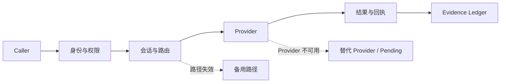

# TINP

**面向 Agent 与软件服务的本地优先通信运行时：带身份、权限、路由、恢复和执行证据。**

TINP 不解决“怎么调一个 API”这种单点问题。它解决的是请求真正跑起来以后更麻烦的事：**谁在调用、有没有权限、由哪个节点执行、路径坏了怎么办、任务中断后怎么恢复，以及最后能不能复核。**

> 当前版本：`0.1.0-alpha.29`  
> 当前状态：`VERIFIED_LOCAL_CANDIDATE / NOT_DEPLOYED`

这表示当前版本已经通过本机集成验证，但还不是生产网络，也不声称已经具备互联网规模、生产级密钥托管或军用安全认证。

## 3 分钟试一下

```powershell
python -m pip install -r adapters/requirements.txt
npm run demo -- "我要使用字符计数能力完成：你好，TINP"
```

完整说明见 [`DEMO.md`](DEMO.md)。

当前演示只做很小的 Unicode 字符计数，目的不是展示业务能力，而是验证这条链能不能闭环：

```text
主体
  ↓
能力协商
  ↓
权限检查
  ↓
会话
  ↓
路由
  ↓
Provider 执行
  ↓
结果 + 回执 + 证据
```

## 它能做什么

当前候选已经覆盖：

- 主体、节点和密钥分离；
- Ed25519 签名、权限租约和会话状态；
- Provider 目录与 OPP 能力协商；
- 本机多进程、UDP、TCP 与多跳请求；
- 备用路由和满足同一契约时的 Provider 替换；
- 重复请求回执、分叉拒绝和 Evidence Ledger；
- Windows 持久状态、节点重启和协调器中断恢复；
- Pending 请求管理和 Recovery Anchor；
- Authority Registry、历史分发与收敛候选；
- TLS 1.3 loopback 状态传输和可恢复分块传输；
- 受策略约束的 OPP HTTP / native interop 接入。

详细模块见 [`docs/ARCHITECTURE.md`](docs/ARCHITECTURE.md)。

## 三个最直接的用途

### 1. 私有 Agent 网络

多个 Agent、服务和本地节点之间，不只是“能调用”，还要知道谁能调用、权限什么时候失效、结果在哪里执行。

### 2. 故障后的切换和恢复

路径坏了时尝试合法备用路径；Provider 不可用时，在契约和权限允许的情况下切换；无法确认时保持 `pending`，而不是假装成功或盲目重试。

### 3. 需要审计的自动化

一次请求从主体、权限、路由、Provider 到结果和恢复过程，都尽量留下可复核证据。

更多现实映射见 [`docs/REAL_WORLD_EXAMPLES.md`](docs/REAL_WORLD_EXAMPLES.md)。

## 工作方式



TINP 的目标不是“永不失败”，而是**失败时不丢身份、不静默扩大权限、不把未知状态包装成成功。**

## 和 OPP 的分工

```text
OPP：这个系统会什么？两个系统能不能接？怎么转换？
TINP：谁能调用？怎么传？失败怎么办？怎么恢复？
```

TINP 会使用 OPP 的能力协商和互操作结果，但“能力兼容”不会自动变成“已经授权”。

OPP：<https://github.com/xingxuling/OPP>

## 当前还没证明什么

当前**没有被证明**的能力包括：

- 公网规模部署；
- 两台真实物理设备之间的生产级运行；
- 无引导节点的公网发现；
- 生产 Authority Provider；
- HSM / 专用硬件密钥托管；
- 可信外部时间；
- 全网分布式共识和互联网规模状态收敛；
- 高影响外部动作的 exactly-once 保证；
- 完整跨设备密钥迁移；
- 第三方或军用安全认证。

当前 TLS、恢复、分发和收敛证据主要来自**本机受控环境**。

## 验证状态

`alpha.29` 当前集成法院记录：

```text
209 / 209 tests passed
0 failed
status: VERIFIED_LOCAL_CANDIDATE
```

完整证据：

- [`evidence/0.1.0-alpha.29/INTEGRATION_COURT.md`](evidence/0.1.0-alpha.29/INTEGRATION_COURT.md)
- [`evidence/0.1.0-alpha.29/EVIDENCE_LEDGER.json`](evidence/0.1.0-alpha.29/EVIDENCE_LEDGER.json)
- [`docs/EXTERNAL_ACCEPTANCE_GATES.md`](docs/EXTERNAL_ACCEPTANCE_GATES.md)

## 文档入口

- [`DEMO.md`](DEMO.md) — 3 分钟演示
- [`docs/USE_CASES.md`](docs/USE_CASES.md) — 什么时候值得用 TINP
- [`docs/REAL_WORLD_EXAMPLES.md`](docs/REAL_WORLD_EXAMPLES.md) — 三个现实业务映射
- [`docs/ARCHITECTURE.md`](docs/ARCHITECTURE.md) — 架构和模块分工
- [`docs/NEXT_GAP.md`](docs/NEXT_GAP.md) — 当前最短真实缺口
- [`docs/EXTERNAL_ACCEPTANCE_GATES.md`](docs/EXTERNAL_ACCEPTANCE_GATES.md) — 外部验收门
- [`CONTRIBUTING.md`](CONTRIBUTING.md) — 参与开发
- [`SECURITY.md`](SECURITY.md) — 安全问题报告
- [`ROADMAP.md`](ROADMAP.md) — 后续路线

## 许可

这个仓库包含历史来源快照和 `vendor/` 目录，公开仓库不等于所有历史组件都自动拥有统一开放许可。

对外再分发、打包或商业发行前，请以 [`docs/LICENSE_AUDIT.md`](docs/LICENSE_AUDIT.md) 为准。
