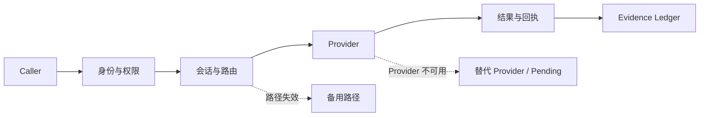

# TINP

**让多个 Agent 和软件服务在本地或私有环境里协作时，知道谁在调用、有没有权限、失败后怎么办，以及事后能不能复核。**

调用一个 API 并不难。真正难的是系统开始自动执行以后：

- 这次请求是谁发的？
- 它当时有没有权限？权限什么时候失效？
- Provider 或中间节点挂了以后能不能换？
- 请求超时了，到底能不能安全重试？
- 如果不知道上一次有没有执行成功，怎么办？
- 出问题以后，能不能还原当时发生了什么？

**TINP 主要解决这些问题。**

> 当前版本：`0.1.0-alpha.29`  
> 当前状态：`VERIFIED_LOCAL_CANDIDATE / NOT_DEPLOYED`

当前版本已经通过本机集成验证，但仍是研究/试点候选，不是生产公网，也不声称已经具备生产级密钥托管、第三方安全认证或军用安全认证。

> **许可提醒：** 仓库包含历史来源快照和 `vendor/`。对外再分发、打包或商业发行前，请先看 [`docs/LICENSE_AUDIT.md`](docs/LICENSE_AUDIT.md)。

## 先看业务故障 Demo

比“字符计数”更容易理解 TINP 的方式，是直接看一个企业内部 Agent 请求在故障时怎么处理。

```powershell
python -m pip install -r adapters/requirements.txt
npm run business:demo
```

这个 Demo 会真实跑三次本机请求：

```text
1. 正常：A -> B -> C
2. 主 Provider C 不可用：切换到备用 Provider B
3. A-B 中间链路故障：改走 A -> C
```

每一步都会打印：

- 实际路由；
- 实际 Provider；
- 服务等级；
- 回执根；
- 当前证据根。

业务文本只是演示载荷，不连接真实 CRM；底层 Provider 仍使用只读、确定性的测试能力。这个 Demo 要展示的是**故障发生以后，身份、权限、路由和证据是否还能保持连续**。

完整说明见 [`BUSINESS_DEMO.md`](BUSINESS_DEMO.md)。

## 什么时候你会需要它？

如果你只有一个 Agent 调几个普通 API，TINP 很可能不是必需的。

当系统开始出现下面这些问题时，TINP 才有价值：

```text
能不能调用
    ↓
谁能调用
    ↓
能调用多久
    ↓
由哪个节点执行
    ↓
失败能不能重试
    ↓
换节点后权限还算不算
    ↓
出事后怎么证明当时发生了什么
```

典型场景包括：私有 Agent 网络、企业内部自动化、边缘/本地节点协作，以及需要恢复和审计的受控执行。

## 它和你已经认识的工具有什么区别？

TINP 不是用来取代这些工具的。

| 技术 | 主要解决什么 | TINP 补在哪里 |
|---|---|---|
| **MCP** | Agent 怎么发现和调用工具 | 调用前后的身份、权限、失败和证据 |
| **A2A** | Agent 与 Agent 怎么通信协作 | 执行治理、节点、权限和恢复 |
| **gRPC / REST** | 服务怎么发请求和收响应 | 不替代 RPC；关注请求背后的主体和执行状态 |
| **OAuth / OIDC** | 认证与授权委托 | 可以一起使用；TINP 不替代 OAuth/OIDC |
| **Temporal** | 持久工作流和重试编排 | 有恢复问题交集，但 TINP 不是工作流引擎 |
| **Kafka / RabbitMQ** | 消息传输、队列和缓冲 | TINP 不重新发明消息队列 |
| **OPP** | 能力是什么、两个系统能不能接 | TINP 接管身份、权限、路由、恢复和证据 |

更完整的说明见 [`docs/COMPARISON.md`](docs/COMPARISON.md)。

## 技术最小 Demo（3 分钟）

如果想看最小执行链：

```powershell
python -m pip install -r adapters/requirements.txt
npm run demo -- "我要使用字符计数能力完成：你好，TINP"
```

当前最小 Demo 故意只做 Unicode 字符计数。重点不是“数几个字”，而是验证整条执行链能不能闭环。

当前 `scripts/demo.mjs` 会输出下面这些字段；路径、节点和文件名会随实际运行变化：

```json
{
  "用户意图": "...",
  "结果": {"count": 0},
  "状态": "...",
  "路径": ["..."],
  "证据账本": "...",
  "验证范围": "三个独立本机进程，真实回环传输",
  "nodes": {"...": "..."}
}
```

这里的 `count: 0` 只是结构示例，不是固定运行结果。真实结果由输入决定。

完整说明见 [`DEMO.md`](DEMO.md)。当前版本的完整验证记录是：

```text
209 / 209 tests passed
0 failed
status: VERIFIED_LOCAL_CANDIDATE
```

证据见 [`evidence/0.1.0-alpha.29/INTEGRATION_COURT.md`](evidence/0.1.0-alpha.29/INTEGRATION_COURT.md)。

## 它实际做了什么？



TINP 的目标不是“永不失败”，而是：

> **失败时不丢身份、不静默扩大权限、不把未知状态包装成成功。**

当前候选已经覆盖身份、签名、权限租约、会话、Provider 目录、多跳请求、备用路由、Provider 替换、回执、证据账本、持久恢复、Pending、Recovery Anchor、Authority Registry 候选、TLS loopback 状态传输和可恢复分块传输等能力。

如果这些术语看着烦，先不用管。普通话解释见 [`docs/GLOSSARY.md`](docs/GLOSSARY.md)。

## 适合谁 / 不适合谁

### 适合

- 正在做多个 Agent / 服务互相调用的平台团队；
- 需要“谁能做什么、多久有效”这类权限边界的企业内部系统；
- 需要故障切换、恢复和未决状态管理的自动化；
- 需要执行回执、审计证据或失败闭合的试点；
- 边缘、本地、私有网络和弱网络环境的研究验证。

### 暂时不适合

- 只需要简单 API 调用的普通应用；
- 想找成熟生产级 Service Mesh、消息队列或 OAuth 平台的团队；
- 需要现成云控制台、商业 SLA、HSM 托管和大规模生产案例的客户；
- 需要已经完成第三方安全认证的系统。

## 三类价值怎么理解

| 方向 | 现在能看到的价值 | 当前成熟度 |
|---|---|---|
| **企业 / 商业** | Agent/服务调用治理、权限边界、恢复和审计 | 适合原型、PoC、试点 |
| **高保障 / 受监管环境** | fail-closed、断连、恢复、操作员批准、证据 | 有研究价值，但不能宣称生产或认证级能力 |
| **个人 / 生活化** | 本地 AI 的一次性权限、操作历史、跨节点恢复 | 目前只是长期产品化方向，还不是消费产品 |

## OPP 和 TINP 的分工

```text
OPP：这个系统会什么？两个系统能不能接？怎么转换？
TINP：谁能调用？怎么传？失败怎么办？怎么恢复？
```

TINP 会使用 OPP 的能力协商和互操作结果，但**能力兼容不等于已经授权**。

OPP：<https://github.com/xingxuling/OPP>

## 当前还没证明什么

当前**没有被证明**的能力包括：

- 公网规模部署；
- 两台真实物理设备之间的生产级运行；
- 无引导节点的公网发现；
- 生产 Authority Provider；
- HSM / 专用硬件密钥托管；
- 可信外部时间；
- 全网分布式共识和互联网规模状态收敛；
- 高影响外部动作的 exactly-once 保证；
- 完整跨设备密钥迁移；
- 第三方或军用安全认证。

当前 TLS、恢复、分发和收敛证据主要来自**本机受控环境**。

## 文档入口

- [`BUSINESS_DEMO.md`](BUSINESS_DEMO.md) — 业务故障 Demo：Provider / 链路切换
- [`DEMO.md`](DEMO.md) — 技术最小 Demo
- [`docs/COMPARISON.md`](docs/COMPARISON.md) — 和 MCP / A2A / OAuth / Temporal / MQ 的关系
- [`docs/GLOSSARY.md`](docs/GLOSSARY.md) — 术语翻成普通话
- [`docs/USE_CASES.md`](docs/USE_CASES.md) — 什么时候值得用 TINP
- [`docs/REAL_WORLD_EXAMPLES.md`](docs/REAL_WORLD_EXAMPLES.md) — 现实业务映射
- [`docs/ARCHITECTURE.md`](docs/ARCHITECTURE.md) — 架构和模块分工
- [`docs/NEXT_GAP.md`](docs/NEXT_GAP.md) — 当前最短真实缺口
- [`docs/EXTERNAL_ACCEPTANCE_GATES.md`](docs/EXTERNAL_ACCEPTANCE_GATES.md) — 外部验收门
- [`ROADMAP.md`](ROADMAP.md) — 后续路线
- [`SECURITY.md`](SECURITY.md) — 安全边界与报告方式

## License / 许可

这个仓库包含历史来源快照和 `vendor/` 目录，公开仓库不等于所有历史组件都自动拥有统一开放许可。

对外再分发、打包或商业发行前，请以 [`docs/LICENSE_AUDIT.md`](docs/LICENSE_AUDIT.md) 为准。
