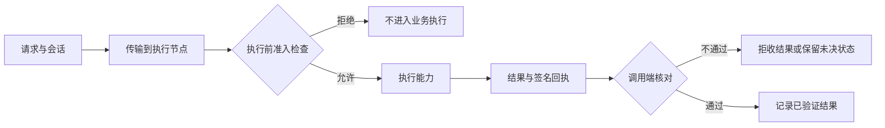

# TINP：让受控请求在授权范围内执行，并把故障后的状态说清楚

> 文档代码基线：`codex/next-internet-v01@729113b89e6dea59033b64c2aab3dca0c28f5fc3`，远端核对时间2026-10-03 12:32 UTC。版本号仍是alpha.29，但不能据此把所有alpha.29报告归为同一源码。

你已经有一个 Agent 和若干服务。现在要解决三个具体问题：没有权限的请求不能到业务函数里；主服务不可用时，备用路径不能获得更多权限；结果丢失或失败时，系统不能假装成功，也不能盲目重复执行。

> 当前版本：`0.1.0-alpha.29`；状态：`VERIFIED_LOCAL_CANDIDATE / NOT_DEPLOYED`
> 对外许可与发行资格：`NOT_ADJUDICATED`，见 [许可审计](docs/LICENSE_AUDIT.md)

TINP 当前提供候选运行时，已有本机多进程验证，也已有本地优先 Wi-Fi/LAN 承载实现；这里的最短示例使用本机 TCP。现有代码不等于已经完成真实物理双机的生产验收。它在受控执行入口检查身份、权限、会话和路由，执行后核对结果与请求的绑定。独立 Provider SDK 尚未稳定发布，接入自己的业务仍需要源码级 PoC。

## 先跑一个只包含本地测试能力的故障演示

前置条件：Node.js 22+、可运行 OPP 依赖的 Python（OPP 要求 3.10+）。在 TINP 仓库根目录执行：

```powershell
python -m venv .venv-doc-demo
$py = Join-Path $PWD '.venv-doc-demo/Scripts/python.exe'
& $py -m pip install -r adapters/requirements.txt
$env:NEXT_INTERNET_PYTHON = $py
node scripts/business-demo.mjs --out .runs/business-demo-doc.json
```

`NEXT_INTERNET_PYTHON` 明确告诉 Node 子进程使用刚安装依赖的 Python，避免“依赖装进一个环境、适配器调用另一个环境”。macOS/Linux 使用虚拟环境的 `bin/python` 并导出同名环境变量。请使用新的输出文件名保存每次结果。

此命令会启动三个本机节点进程，发送真实本地 TCP 请求，并人为关闭 Provider 或阻断链路。演示文字写的是客户订单请求，但实际 Provider 是确定性的 `counter`，没有连接 CRM，也没有读取真实订单。

## 看输出中的三步，不要只看最后的 PASS

| 步骤 | 代码施加的条件 | 应观察的执行路径 | 服务等级 |
|---|---|---|---|
| 正常 | C 可用，链路正常 | A → B → C；C:counter | Full |
| Provider 故障 | 关闭 C 的 Provider | A → B；B:counter | Essential |
| 链路故障 | 恢复 C，双向阻断 A-B | A → C；C:counter | Reduced |

这三步都应显示 `executed`。核对主体、会话和权限租约根是否保持一致，并分别保存新的回执根和证据根。会话、端口和根是运行时值，不应要求它们等于另一台电脑的常量。

“所有 Provider 不可用”不在这个三步脚本里；它来自独立的 `tests/profiles.test.mjs` 测试，应明确返回不执行/延后状态，而不是写成 business-demo 已经输出的第四步。

## 真正接入自己的业务需要什么

1. 定义该能力的输入、输出、版本与权限要求
2. 提供 Provider manifest 和实际处理函数
3. 把处理函数放在执行端检查之后，不能先执行再拿回执补验收
4. 把结果与请求、主体、会话、租约、路由和 Provider 绑定
5. 覆盖未授权、撤权、契约漂移、重复请求、Provider 故障、结果丢失等负例

当前入口是 `InternetSuite.start()` / `suite.use(...)` 及内部 Provider 路径；不要把设计中的 `registerProvider` 等接口写成已经发布的 API。现有真实服务如果还有绕过受控入口的凭据或直接访问路径，TINP 不会自动阻止那个旁路。

## 执行前和执行后各自保证什么

执行前检查失败：拒绝当前受控业务执行。执行后回执失败：不接受为已验证结果，但不能撤销此前已经发生的动作。节点失联或响应丢失不等于业务必然未执行；需要按对应恢复路径核对，不可把重试理解为天然安全。

## OPP + TINP 目前的一条可复核组合路径

`OPP 生成 native interop result → TINP 校验其结构和各层 root → 生成 acceptance binding`。

在 TINP 仓库根目录运行下面的只读校验示例。它读取已有证据，不重新调用 OPP 或任何业务 Provider：

```bash
node --input-type=module -e "import fs from 'node:fs'; import {makeOppNativeInteropAcceptance,validateOppNativeInteropAcceptance} from './src/opp-native-interop.mjs'; const interopResult=JSON.parse(fs.readFileSync('evidence/OPP_NATIVE_INTEROP_2026-09-12.json','utf8')); const acceptance=makeOppNativeInteropAcceptance({interopResult}); console.log(JSON.stringify({acceptance,verified:validateOppNativeInteropAcceptance(acceptance,{interopResult})},null,2));"
```

预期 `verified:true`、acceptance 的 `status:'PASS'`、`authorityGranted:false`、`sideEffects:false`。这说明该验收动作没有新增执行权限或副作用；不是说 OPP 此前绝对没有执行任何动作，也不是把任意 OPP bridge 自动接入 TINP 在线授权执行链。

当前仍为 alpha.29 / 本地验证候选，不承诺生产 SLA、独立安全认证或跨设备生产部署。对外许可与发行资格仍按 `docs/LICENSE_AUDIT.md` 的 `NOT_ADJUDICATED` 状态处理。

## 安装和测试要使用同一 Python

`adapters/requirements.txt` 声明 `jsonschema>=4.23`。从 `729113b` 开始，`npm test` 通过 `scripts/test.mjs` 运行：未指定 `NEXT_INTERNET_PYTHON` 时创建项目内 `.tinp-python` 并安装依赖；指定时只检查该解释器，不替你修改它，缺依赖就明确失败。

```powershell
npm test
```

前面的业务demo仍显式设置自己的虚拟环境，因为自动引导属于测试入口，并不自动修改之后任意终端命令的环境。可单独运行 `npm run python:bootstrap` 建立测试环境；旧的无引导测试入口是 `npm run test:raw`。

历史 alpha.29 [INTEGRATION_COURT](evidence/0.1.0-alpha.29/INTEGRATION_COURT.md) 记录209/209；新提交的 `tinp.txt` 记录223/223。这是两份不同的运行材料，不是相互替代的“当前测试总数”。`729113b` 又增加了原型链负例，必须另行运行并保存实际结果，不能从新增测试数量推导新的通过数。

## 四份提交材料：观察、来源与适用范围

以下材料由使用者提交用于本次评审，尚未连同其全部原始数据在本仓库归档。材料没有提供可核对的源码commit；“报告自述”与“本次静态代码核对”分开。另一项正在进行的本机基准不包含在这里，不填入其结果。

| 来源与精确位置 | 材料显示什么 | 能支持到哪里 |
|---|---|---|
| `opp.txt` L6–134、L139–218、L219–258 | 初次先运行后安装报`ModuleNotFoundError`；安装后66项：64通过、1跳过、1个`WinError1314`；业务demo为PASS | 该终端环境里的安装、测试与固定demo；不是完整测试全部通过 |
| `tinp.txt` L9–68、L70–71、L314–323 | alpha.29三步故障demo；旧式test入口；223项通过、0失败 | 该次本机运行；源码commit未知，不能当729113b完整复测 |
| `OPP-TINP兼容性测试报告.pdf` p4–9 | 补依赖后TINP223/223；OPP64通过/1失败/1跳过；握手150/150、协商180/180、联合12/12；篡改检测25/26 | 报告自述的受控样本，包含负例；不是通用可靠性或独立认证 |
| `report.md` L3–16、L42、L63–77 | 每场景1000次、25,000记录；HTTP完整链1000/1000、均值45.248ms；自述33/33复核 | Ryzen9700X/Python3.12.14、单机合成数据与本地HTTP；未随附samples/summary/manifest，未在本次重算 |

PDF p4/p10 的缺依赖失败需要保留为当次观察。其“未声明依赖”的解释与已查源码中存在requirements不同：旧代码通过默认`python`调用，声明依赖并不保证该解释器安装了依赖。新TINP测试引导是后续代码变化，不能用来否认报告当时失败。

性能口径也不能混用：PDF p6 的CLI进程端到端约230.0ms（n=12），p8 的TINP校验47.11µs；`report.md` 的本地HTTP全链路45.248ms（n=1000）来自另一台机器和另一条路径。它们不能组成“优化前后”的结论。恢复样本是调用者显式切换健康Provider后的重新调用，不是生产自动恢复率。

## 证据读法与现有边界

- 三步业务demo：证明固定本地受控能力在指定故障下的路径与证据变化，不证明真实订单系统接入
- [执行前/执行后测试](docs/ENFORCEMENT_AND_EVIDENCE.md)：区分前置拒绝、合法执行与回执篡改，不把“全拒绝”当成正确实现
- [OPP验收证据](evidence/0.1.0-alpha.29/opp-native-interop-acceptance.json)：证明指定结果的验收绑定，不授予执行权限
- 数字只能描述其场景与样本；本地负例通过不能外推公网可靠性或生产安全

PDF报告记录一个原型链篡改漏检。旧基线 `1164705d` 的 `exact()` 没有显式检查原型，与该观察方向一致。`729113b` 已增加递归 `assertCanonicalJsonData()`，限制对象/数组原型、属性描述符、有限数值和循环引用，并新增顶层/嵌套继承属性的负例测试。这里确认的是代码及测试定义已经新增；本次未执行第三方26个探针，因此不宣称报告中的25/26已变成26/26，也不把历史缺陷记录删除。

## 它和你已经认识的工具有什么区别？

TINP 不是用来取代这些工具的。

| 技术 | 主要解决什么 | TINP 补在哪里 |
|---|---|---|
| **MCP** | Agent 怎么发现和调用工具 | 调用前后的身份、权限、失败和证据 |
| **A2A** | Agent 与 Agent 怎么通信协作 | 执行治理、节点、权限和恢复 |
| **gRPC / REST** | 服务怎么发请求和收响应 | 不替代 RPC；关注请求背后的主体和执行状态 |
| **OAuth / OIDC** | 认证与授权委托 | 可以一起使用；TINP 不替代 OAuth/OIDC |
| **Temporal** | 持久工作流和重试编排 | 有恢复问题交集，但 TINP 不是工作流引擎 |
| **Kafka / RabbitMQ** | 消息传输、队列和缓冲 | TINP 不重新发明消息队列 |
| **OPP** | 能力是什么、两个系统能不能接 | TINP 接管身份、权限、路由、恢复和证据 |

更完整的说明见 [`docs/COMPARISON.md`](docs/COMPARISON.md)。

## 它实际做了什么？


```mermaid
flowchart LR
    A[请求与会话] --> B[传输到执行节点]
    B --> C{执行前准入检查}
    C -->|拒绝| D[不进入业务执行]
    C -->|允许| E[执行能力]
    E --> F[结果与签名回执]
    F --> G{调用端核对}
    G -->|不通过| H[拒收结果或保留未决状态]
    G -->|通过| I[记录已验证结果]
```

当前准入检查在 `src/node-process.mjs` 中调用 RCL 路由规则和事务规则，之后才进入业务计算。调用端的 `verifyReceipt` 则核对签名、请求、会话、租约、结果等绑定关系。

回执不是“事情绝对正确”的证明：签名用于核对来源与完整性；字符计数示例还会独立核算结果。任意业务的正确性仍需要各自的验收条件。

## 本地优先承载的实现与证据

仓库已有 [Wi-Fi/LAN 本地优先承载](docs/LOCAL_FIRST_BEARER.md)、非loopback绑定、发现候选和RCL门控实现。发现候选不自动成为可信节点；这些代码和本机测试不代替真实双物理设备的独立验收。

## 五个常见术语，直接翻成人话

| 术语 | 一句话解释 |
|---|---|
| **Continuity Root** | 表示“还是同一个主体连续状态”的根标识；不是现实身份证明 |
| **Authority Registry** | 当前规则下哪些签署方、公钥和角色被认可的候选注册结构 |
| **Evidence Ledger** | 按顺序保存执行证据，并用哈希链连起来的账本 |
| **Recovery Anchor** | 外部保留的已知恢复锚点，用来帮助发现回退或旧状态替换 |
| **Pending** | 无法确认请求是否已经完成时留下的未决状态；默认不盲目重发 |

完整术语表见 [`docs/GLOSSARY.md`](docs/GLOSSARY.md)。

## 适合谁 / 不适合谁

### 适合

- 正在做多个 Agent / 服务互相调用的平台团队；
- 需要“谁能做什么、多久有效”这类权限边界的企业内部系统；
- 需要故障切换、恢复和未决状态管理的自动化；
- 需要执行回执、审计证据或失败闭合的试点；
- 边缘、本地、私有网络和弱网络环境的研究验证。

### 暂时不适合

- 只需要简单 API 调用的普通应用；
- 想找成熟生产级 Service Mesh、消息队列或 OAuth 平台的团队；
- 需要现成云控制台、商业 SLA、HSM 托管和大规模生产案例的客户；
- 需要已经完成第三方安全认证的系统。

## 三类价值怎么理解

| 方向 | 现在能看到的价值 | 当前成熟度 |
|---|---|---|
| **企业 / 商业** | Agent/服务调用治理、权限边界、恢复和审计 | 适合原型、PoC、试点 |
| **高保障 / 受监管环境** | fail-closed、断连、恢复、操作员批准、证据 | 有研究价值，但不能宣称生产或认证级能力 |
| **个人 / 生活化** | 本地 AI 的一次性权限、操作历史、跨节点恢复 | 目前只是长期产品化方向，还不是消费产品 |

## 从试点到生产还差什么？

当前路线不是“alpha 再改几个版本号就生产”，而是有明确验收门：

```text
当前：VERIFIED_LOCAL_CANDIDATE
        ↓
稳定第三方集成接口
        ↓
真实两台设备闭环
        ↓
生产 Authority + 密钥生命周期
        ↓
可信时间 + 独立第三方接入
        ↓
独立安全评估
        ↓
才讨论生产部署
```

最关键的未完成项包括：

- 稳定第三方 Caller / Provider 接口；
- 真实物理多机验证；
- 生产 Authority Owner；
- 完整密钥生成、托管、轮换、撤销与恢复；
- 可信外部时间与透明历史；
- 独立第三方 consumer；
- 独立安全评估。

完整路线见 [`ROADMAP.md`](ROADMAP.md) 和 [`docs/NEXT_GAP.md`](docs/NEXT_GAP.md)。

## 当前还没证明什么

当前**没有被证明**的能力包括：

- 公网规模部署；
- 两台真实物理设备之间的生产级运行；
- 无引导节点的公网发现；
- 生产 Authority Provider；
- HSM / 专用硬件密钥托管；
- 可信外部时间；
- 全网分布式共识和互联网规模状态收敛；
- 高影响外部动作的 exactly-once 保证；
- 完整跨设备密钥迁移；
- 第三方或军用安全认证。

当前 TLS、恢复、分发和收敛证据主要来自**本机受控环境**。

## 文档入口

- [`BUSINESS_DEMO.md`](BUSINESS_DEMO.md) — 业务故障 Demo：Provider / 链路切换与运行证据导出
- [`DEMO.md`](DEMO.md) — 技术最小 Demo
- [`docs/ENFORCEMENT_AND_EVIDENCE.md`](docs/ENFORCEMENT_AND_EVIDENCE.md) — 执行前拒绝、执行后核对及测试
- [`docs/INTEGRATION.md`](docs/INTEGRATION.md) — 怎么接自己的 Agent / Provider
- [`docs/COMPARISON.md`](docs/COMPARISON.md) — 和 MCP / A2A / OAuth / Temporal / MQ 的关系
- [`docs/GLOSSARY.md`](docs/GLOSSARY.md) — 术语翻成普通话
- [`docs/USE_CASES.md`](docs/USE_CASES.md) — 什么时候值得用 TINP
- [`docs/REAL_WORLD_EXAMPLES.md`](docs/REAL_WORLD_EXAMPLES.md) — 现实业务映射
- [`docs/ARCHITECTURE.md`](docs/ARCHITECTURE.md) — 架构和模块分工
- [`docs/NEXT_GAP.md`](docs/NEXT_GAP.md) — 当前最短真实缺口
- [`docs/EXTERNAL_ACCEPTANCE_GATES.md`](docs/EXTERNAL_ACCEPTANCE_GATES.md) — 外部验收门
- [`ROADMAP.md`](ROADMAP.md) — 从试点到生产的路线
- [`SECURITY.md`](SECURITY.md) — 安全边界与报告方式
- [`docs/LICENSE_AUDIT.md`](docs/LICENSE_AUDIT.md) — 当前许可审计

## License / 许可

当前仓库的对外许可与发行资格仍是 **`NOT_ADJUDICATED`**。

公开仓库不等于所有历史组件都自动拥有统一开放许可。特别是 `vendor/` 中的固定历史快照不能因为上游后来出现新许可证，就自动追溯获得同一结论。

如果要对外打包、再分发或商业发行，请先完成各来源组件的许可核对与裁决。详见 [`docs/LICENSE_AUDIT.md`](docs/LICENSE_AUDIT.md)。

## 外部接入候选（2026-09-12，仓库报告）

新增 `@taowind/tinp-suite/sdk/v1.mjs`，公开现有只读 Provider 与回执入口，仍是未发布候选，非通用 Provider 注册 SDK。独立安装包实测 Open-Meteo 请求与离线复核成功；httpbingo 的 HTTP 402 作为失败保留。OPP 三个真实库的回执由 Node 复核通过，但两边仍是同一操作员。

[SDK 接入](docs/PUBLIC_SDK.md) · [五项目实测](docs/EXTERNAL_ONBOARDING.md) · [ROADMAP](ROADMAP.md)。此前章节描述 alpha.29 基线，本节为当前候选增量；未解除真实双机、Authority Provider、可信时间或独立审计门。

## 历史托管验证记录（2026-09-12，仓库报告）

GitHub [远端执行 34692267549](https://github.com/xingxuling/TINP/actions/runs/34692267549) 的 Linux 生产端及 Linux / Windows 复核端全部成功。真实库运行与证据交接已离开当前电脑；仍不代表双物理设备、独立操作员或真实 Authority Provider。

Final code replay: [34692507409](https://github.com/xingxuling/TINP/actions/runs/34692507409), all three hosted jobs PASS; OPP `7c4970c`, TINP `692c0e4`. The earlier run is retained as historical evidence.
