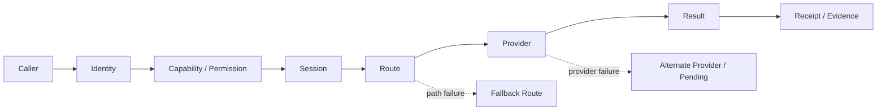

# TINP 架构说明

这份文档只解释 TINP 的主要模块和请求是怎么流动的。

## TINP 解决的不是“怎么调 API”

OPP 更关心能力和接口是否匹配；TINP 更关心请求进入系统之后的现实问题：

```text
谁发起
有没有权限
走哪条路
由谁执行
失败后怎么办
怎么恢复
最后留下什么证据
```

## 一次请求的主链



## 六个主要部分

### 1. Identity

负责区分主体、节点和密钥，不把“当前在哪台机器上”直接等同于“你是谁”。

主要实现包括：

```text
src/identity.mjs
src/node-state.mjs
```

### 2. Permission / Authority

负责租约、权限范围、操作员批准，以及 Authority Registry 候选。

主要实现包括：

```text
src/authority-registry.mjs
src/operator-authorization.mjs
adapters/aaf-operator.mjs
```

核心原则：

> 协商成功不等于自动获得权限。

### 3. Session / Coordinator

负责请求在执行、重启和恢复过程中的状态。

主要实现包括：

```text
src/coordinator-state.mjs
src/pending-management.mjs
```

当系统无法确认一个请求到底有没有完成时，TINP 更倾向于保留 `pending`，而不是偷偷再执行一次。

### 4. Routing / Transport

负责节点之间的传输、路径选择、备用路径以及状态传输。

当前已有本机多进程、UDP、TCP、TLS 1.3 loopback 和可恢复分块传输证据。

这些证据仍不等于真实公网和生产跨设备部署。

### 5. Evidence / Recovery

负责回执、证据链、恢复锚和状态重放。

主要实现包括：

```text
src/evidence.mjs
src/recovery-anchor.mjs
src/authority-registry-convergence*.mjs
```

设计目标不是“永不失败”，而是：

```text
失败时尽量知道发生了什么
恢复时不静默扩大权限
无法确认时明确保留未知状态
```

### 6. OPP Interop

TINP 可以使用 OPP 的能力协商和互操作结果，但不会把“能力兼容”当成“已经授权”。

主要实现包括：

```text
src/opp-native-interop.mjs
src/opp-http-readonly.mjs
src/opp-http-consumer-bridge.mjs
src/opp-http-consumer-live.mjs
```

## 故障时怎么想

假设正常路径：

```text
A -> B -> C
```

如果 B 失效：

```text
A -> D -> C
```

如果 C 失效，但 E 提供同一能力并满足契约和权限：

```text
A -> D -> E
```

如果没有合法 Provider：

```text
保留身份
保留会话
保留证据
进入 pending
```

而不是：

```text
无限重试
静默换权限
假装成功
```

## 当前最重要的边界

TINP 目前仍缺少生产级外部 Owner 能力，包括：

- 真实跨设备生产验证；
- 生产 Authority Provider；
- 完整密钥生命周期与硬件托管；
- 可信外部时间；
- 透明日志 / 全局冲突处置；
- 独立第三方安全评估。

所以当前状态仍是：

```text
VERIFIED_LOCAL_CANDIDATE / NOT_DEPLOYED
```

详细缺口见 [`NEXT_GAP.md`](NEXT_GAP.md) 和 [`EXTERNAL_ACCEPTANCE_GATES.md`](EXTERNAL_ACCEPTANCE_GATES.md)。
