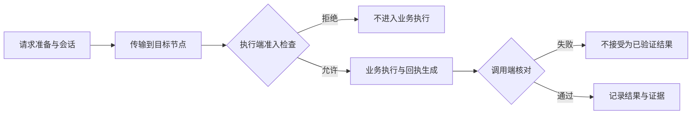

# TINP 架构说明

TINP 的在线执行链包含执行前准入，不只是一个事后审计工具。这里按职责说明现有模块，没有引入三个新的服务，也没有增加新的协议名。

## 三个职责，两个不同的拒绝点

| 职责 | 发生在什么时候 | 主要实现 |
|---|---|---|
| 执行前强制约束 | 业务能力运行前 | `src/node-process.mjs`、RCL 路由与事务规则 |
| 传输与执行 | 请求传输、能力运行和故障处理时 | `src/transport.mjs`、`src/routing.mjs`、`src/suite.mjs` |
| 执行后核对与证据 | 收到结果，以及恢复时 | `verifyReceipt()`、`src/evidence.mjs`、回执验收模块 |



执行前的拒绝阻止本次业务计算。执行后的拒收阻止把不匹配的结果视为成功，但不能自动撤销已经发生的动作。

## 前置约束不是只放在调用端

调用端负责准备会话、选择满足约束的节点和路径，但执行端不能只相信这些准备工作。`src/node-process.mjs` 的 `execute()` 会重新检查请求绑定与策略，并按顺序调用：

```text
租约、会话、签名、请求与路由绑定检查
    ↓
evaluateRouteAdmissionGuard：路由准入
    ↓
evaluateTransactionGuard：事务准入
    ↓
重复请求、证据锚与容量检查
    ↓
业务计算
    ↓
签名回执与执行缓存
```

路由与事务准入使用 `rcl/route.rcl`、`rcl/transaction.rcl`。规则输入由服务端适配层从已验证上下文中提取，不把客户端提供的“允许”结论直接当授权。

历史证据也可能参与下一次准入，例如证据连续性和恢复锚检查。因此这三个职责并非完全隔离，不能把所有证据处理都移到异步旁路。

## 模块分工

### 身份

`src/identity.mjs`、`src/node-state.mjs` 区分主体、节点和密钥。“在哪台机器上”不等于“是谁”。

### 权限与准入

`src/node-process.mjs` 是当前受控业务入口。`adapters/rcl-guard.mjs`、`adapters/rcl-route-guard.mjs` 调用 RCL 规则；权限注册和操作员批准另由 `src/authority-registry.mjs`、`src/operator-authorization.mjs`、`adapters/aaf-operator.mjs` 等负责。

协商成功不等于授权；只把规则写成一个返回布尔值的函数，也不等于调用路径不可绕过。

### 会话、协调与恢复

`src/suite.mjs`、`src/coordinator-state.mjs`、`src/pending-management.mjs` 管理会话和未决请求。迁移前检查原主体、期限和权限范围，不能通过换节点扩大权限。

当前只读纯计算路径在特定传输超时后，可以重送同一签名请求一次，由节点去重返回原回执。它不等于允许任意外部写操作重试。恢复中的未决请求另有核对、退休和操作员批准流程。

### 路由与传输

`src/routing.mjs`、`src/transport.mjs` 处理路径选择与节点传输；转发环节检查信封和路径，最终业务准入在执行节点。当前三节点例子中，首选 `A -> B -> C`，备用路径为 `A -> C`；C 的能力不可用时也可尝试满足相同契约的 B。

所有能力提供方都不可用时，`suite.use()` 返回 `deferred / NO_AUTHORIZED_PROVIDER`（暂缓，未找到获授权的能力提供方），不生成成功业务结果。这个状态与“已发送请求但不知是否完成”的持久 `pending`（未决）不能混为一谈。

### 回执与证据

`src/suite.mjs` 的 `verifyReceipt()` 核对签名与绑定，当前字符计数能力还会独立计算预期结果。`src/evidence.mjs` 保存证据链；`src/recovery-anchor.mjs` 与权限历史相关模块处理恢复依据。

签名和哈希链能够核对给定证据的来源与完整性，不能单独证明任意业务结果为真，也不能证明一条恶意节点声明的路径就是真实物理路径。

### OPP 接入和独立校验

`src/opp-native-interop.mjs` 只验收已有 OPP 结果；它不执行原始业务，不追认权限。`src/opp-http-readonly.mjs`、`src/opp-http-consumer-bridge.mjs`、`src/opp-http-consumer-live.mjs` 提供各自有界的只读接入与验收。

当前 `sdk/v1.mjs` 导出了这些已有入口，不是一个通用第三方 Provider 注册接口。不同入口的执行和校验范围见 [集成指南](INTEGRATION.md)。

## 是不是最小内核？

**前置强制约束必须属于受控执行路径的可信部分；整个 TINP 仓库不因此都是“最小安全内核”。** 路由、调试命令、文档、离线分析与管理工具不需要全部挤进最小可信边界。

当前实现也没有证明任意底层资源只能经由 TINP 访问。要成为不可绕过的执行入口，还必须控制资源凭据、直接访问路径、节点代码和策略修改权限，并验证检查与实际动作之间的状态一致性。

详细安全模型、源码位置和测试见 [执行前约束与执行后核对](ENFORCEMENT_AND_EVIDENCE.md)。

## 生产边界

当前仍是 `VERIFIED_LOCAL_CANDIDATE / NOT_DEPLOYED`（本机已验证候选／未生产部署）。远端证据交接测试不等同于真实物理多机执行网络。

真实设备、生产授权管理、密钥生命周期、可信时间及独立安全评估等要求仍见 [ROADMAP](../ROADMAP.md)、[当前缺口](NEXT_GAP.md) 和 [外部验收门](EXTERNAL_ACCEPTANCE_GATES.md)。
